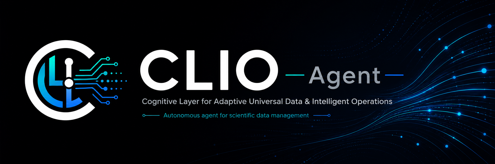
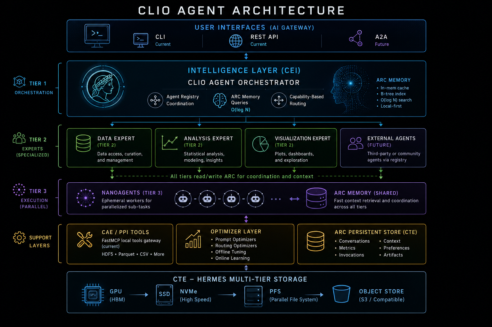

<p align="center">
  
</p>

<p align="center">
  <a href="https://github.com/iowarp/clio-agent/releases"></a>
  <a href="https://www.python.org/downloads/"></a>
  <a href="https://github.com/astral-sh/uv"></a>
  <a href="https://github.com/jlowin/fastmcp"></a>
  <a href="https://iowarp.org"></a>
</p>

---

> ⚠️ **Beta.** CLIO is under active development — interfaces, blueprints, and on-disk
> formats may change between releases. Pin a version for reproducibility.

## What is CLIO Agent?

An autonomous agent for **scientific data management** — HDF5, Parquet, and CSV inspection through a FastMCP tool gateway, with a Bubbletea terminal UI ([gact](https://github.com/iowarp/gact-tui)) for interactive work. CLIO is the Intelligence Layer (CEI) of the [IOWarp](https://iowarp.org) platform.

The agent runs in three tiers: a main orchestrator (planner loop over registered tools and experts), domain experts (data / analysis / visualization), and ephemeral nanoagents for parallel sub-tasks. State lives in a local-first memory layer (ARC) that all tiers read and write.

- Multi-expert orchestration with capability-based routing
- FastMCP tool gateway, HDF5 + Parquet servers out of the box
- ARC memory with O(log N) context retrieval
- Optimizer layer for offline tuning + online learning
- Runtime doctor for LM / gateway / file-policy health
- Works with LM Studio, Ollama, OpenAI, Anthropic, OpenRouter, OpenAI
  Codex subscriptions, and the Argonne ALCF inference gateway

---

## Quick Start

One line installs `clio-agent` from PyPI, downloads the matching CLIO-branded
TUI binary for your platform, and drops a `clio` command on your PATH.

**Linux / macOS**
```sh
curl -fsSL https://raw.githubusercontent.com/iowarp/clio-agent/main/install/install.sh | bash
clio
```

**Windows (PowerShell)**
```powershell
irm https://raw.githubusercontent.com/iowarp/clio-agent/main/install/install.ps1 | iex
clio
```

`clio` boots the server (if it isn't already up) and attaches the TUI. On first connect, pick an LM provider in the modal and you're chatting.

Prerequisites for the default release install: [`uv`](https://astral.sh/uv)
or Python 3.12+ with `pip`. `git` and Go are only needed when you opt into
source-build mode with `CLIO_REF` or `GACT_REF`.

---

## Using the `clio` command

`clio` with no arguments is the one-command UX. The subcommands manage the backing server without hunting PIDs:

| Command | What it does |
|---|---|
| `clio` | ensure the server is up, then attach the TUI |
| `clio start` / `stop` / `restart` | server lifecycle (process-tree kill on stop) |
| `clio status` / `ps` | PID, port, health |
| `clio logs [N]` | tail server + TUI stderr logs |
| `clio doctor` | check prerequisites and install layout |
| `clio report` | diagnostics bundle for filing GitHub issues |
| `clio completion <shell>` | tab-completion (bash / zsh / powershell) |
| `clio uninstall` | remove CLIO (`--purge` / `-Purge` to drop config too) |

Override paths with `CLIO_PREFIX` / `CLIO_BIN_DIR` and the server port with `CLIO_PORT`. Full install + uninstall reference: [install/README.md](install/README.md).

---

## Architecture

<p align="center">
  
</p>

For the design rationale (three-tier hierarchy, ARC memory, optimizer layer, IOWarp integration), see [docs/CLIO_AGENT_ARCHITECTURE.md](docs/CLIO_AGENT_ARCHITECTURE.md).

---

## Documentation

| Doc | What's in it |
|---|---|
| [docs/CLIO_AGENT_ARCHITECTURE.md](docs/CLIO_AGENT_ARCHITECTURE.md) | Three-tier design, ARC memory, optimizer layer |
| [docs/SYSTEM_IDENTITY.md](docs/SYSTEM_IDENTITY.md) | What the agent is, design principles |
| [docs/SETUP.md](docs/SETUP.md) | Release install, source-build install, and smoke test |
| [docs/CONTRIBUTOR_QUICKSTART.md](docs/CONTRIBUTOR_QUICKSTART.md) | Dev environment, quality checks, where to put code |
| [docs/MCP_TOOL_INTEGRATION.md](docs/MCP_TOOL_INTEGRATION.md) | Adding tools via FastMCP |
| [docs/archive/EXPERT_SYSTEM_DESIGN.md](docs/archive/EXPERT_SYSTEM_DESIGN.md) | Adding new experts |
| [docs/ARC_MEMORY_LAYER.md](docs/ARC_MEMORY_LAYER.md) | Memory model and storage |
| [docs/PERMISSIONS.md](docs/PERMISSIONS.md) | Tool permission system |
| [docs/providers/](docs/providers/) | LM provider configuration |
| [docs/archive/CAPABILITIES_MATRIX.md](docs/archive/CAPABILITIES_MATRIX.md) | Feature matrix |
| [docs/design/roadmap.md](docs/design/roadmap.md) | Roadmap |

---

## Contributing

Start with [docs/CONTRIBUTOR_QUICKSTART.md](docs/CONTRIBUTOR_QUICKSTART.md). For guidance specific to AI agents working on the codebase, see [AGENTS.md](AGENTS.md).

---

## License + Citation

BSD-3-Clause.

```bibtex
@software{clioagent2026,
  title  = {CLIO Agent: Autonomous Agent for Scientific Data Management},
  author = {IOWarp Team},
  year   = {2026},
  url    = {https://github.com/iowarp/clio-agent},
}
```
