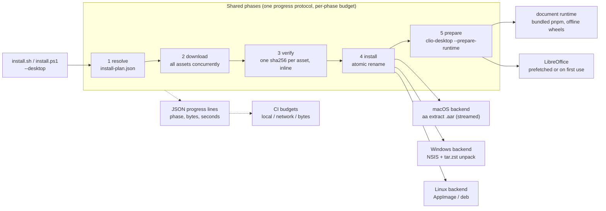

# Unified desktop install: phases and backends

Companion diagram for [desktop-install-unified.md](desktop-install-unified.md).

```mermaid
flowchart LR
    entry["install.sh / install.ps1<br/>--desktop"] --> resolve
    subgraph phases["Shared phases (one progress protocol, per-phase budget)"]
        resolve["1 resolve<br/>install-plan.json"] --> download["2 download<br/>all assets concurrently"]
        download --> verify["3 verify<br/>one sha256 per asset, inline"]
        verify --> install["4 install<br/>atomic rename"]
        install --> prepare["5 prepare<br/>clio-desktop --prepare-runtime"]
    end
    install --> mac["macOS backend<br/>aa extract .aar (streamed)"]
    install --> win["Windows backend<br/>NSIS + tar.zst unpack"]
    install --> lin["Linux backend<br/>AppImage / deb"]
    prepare --> docs["document runtime<br/>bundled pnpm, offline wheels"]
    prepare --> office["LibreOffice<br/>prefetched or on first use"]
    phases -.-> events["JSON progress lines<br/>phase, bytes, seconds"]
    events -.-> budgets["CI budgets<br/>local / network / bytes"]
```
