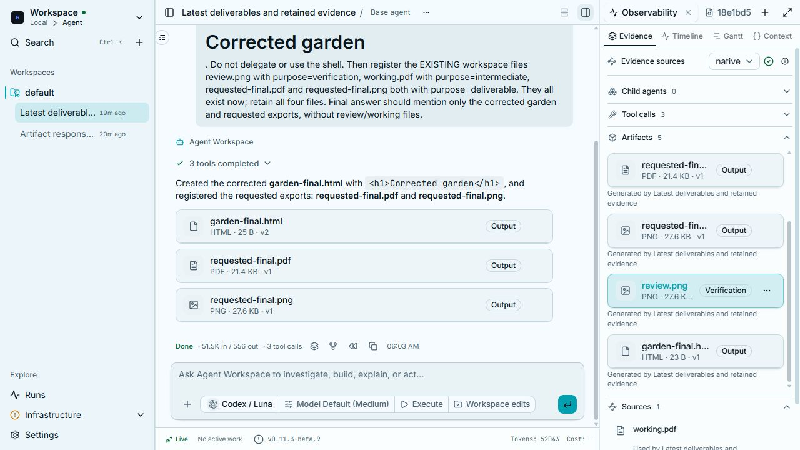
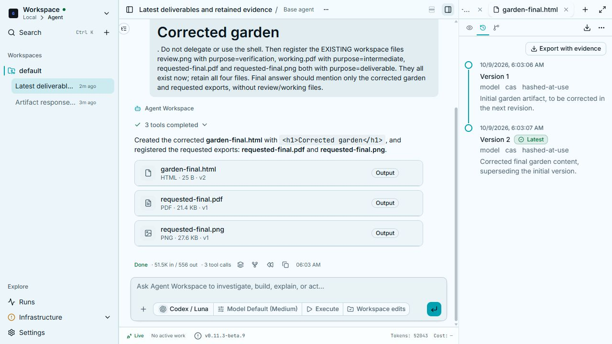

# Artifact response presentation acceptance — 2026-10-09

## Behavior

A completed answer presents the latest deliverable version per artifact family
and producer. It retains earlier versions, verification files and intermediate
files in the registry, exact-version bytes, tool history, Versions and Lineage.
Distinct child sessions/agents keep their separate causal output identities.
Historical answers keep their immutable links; this does not replace their
contents with future revisions. The UI also folds duplicate family versions
already attached to one historical answer when registry ownership is known.

`create_artifact` accepts `purpose=deliverable|verification|intermediate`, defaulting
to `deliverable`. A batch item can override the call's default. Invalid values
are rejected before writing. Purpose is recorded as producer intent and in the
designation event, rather than guessed from names or extensions. Requested
images/PDFs remain deliverables. Automatic document renditions remain previews;
native A2UI captures are verification evidence. Re-designating identical review
bytes can publish them without rewriting their immutable original producer.

Full Observability receives every retained version, with version and purpose
labels. Its compact summary continues to present current deliverables. Existing
inputs/reused artifacts remain accessible in Sources.

## Ordinary live acceptance

The production GACT server and production web build ran locally with Codex/Luna,
using the ordinary `POST /v1/sessions/{sid}/messages` path and native
`create_artifact`. No mocked tool implementation or scripted final answer.

Session: `sess_1ebfee4b0d8f`; answer: `msg_asst_15ac705c649a`.
The agent made three successful calls: initial HTML, corrected HTML, then a batch
of two retained review/working files and two requested exports.

The final response had exactly three resource links/cards:

- `garden-final.html` v2;
- `requested-final.pdf` v1;
- `requested-final.png` v1.

Observability retained the garden's v1/v2, the review PNG and requested exports.
The working PDF reused identical bytes from an earlier run and was visible in
Sources. All six immutable versions/files were retrieved through `/bytes` and
matched their registered SHA-256 values. The earlier HTML's actual preview
rendered **Initial garden**; the response selected **Corrected garden**. Versions
showed both entries with v2 marked Latest. Lineage opened through its normal tab.

The first live attempt is retained separately: the acceptance setup copied its
PNG fixtures too late, and that run correctly reported missing PNG files. It is
not counted as a successful complete acceptance run.

Local evidence directory:
`D:/Libraries/Videos/clio_recordings/2026-10-09-artifact-response/`.
It contains requests, raw messages/registry, the byte/hash check, screenshots and
the initial failed-setup run. The live exercise ran on Windows; selection and
purpose classification are platform-independent Python/TypeScript. This does
not claim Linux/macOS desktop acceptance.

## Checks

- Backend: 165 tests passed, including designation, buffer finalization, real
  registry/bytes HTTP retention, document previews and all child-rollup tests.
  Another 32 protocol/projection tests passed.
- UI: 39 focused tests passed. Four browser tests passed: response/evidence
  projection, artifact row layout and branch/evidence behavior in both themes.
- Production and offline builds, UI lint, Ruff and focused mypy passed.
- All 30 existing CLIO skill discovery/review tests passed. Codex's
  generic skill validator rejects the existing CLIO-specific `title` frontmatter;
  that metadata was preserved.

This is a pending patch. The earlier long saved-dashboard native CTE crash,
fresh offline-file opening acceptance and other-platform visual feedback
acceptance remain the limits documented in
[the visual feedback report](widget-visual-feedback-2026-10-09.md).
