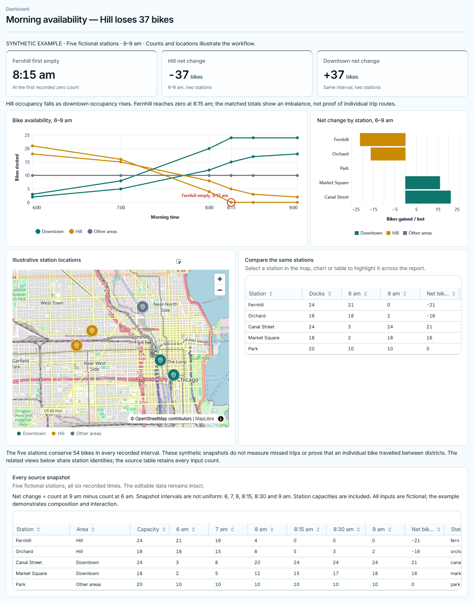

# Report composition and visual review, 2026-10-09

This follows the [original visual-loop checkpoint](widget-visual-feedback-2026-10-09.md).
It records new checks of the report-quality changes in core PR #1684 and UI PR
#572, both targeting `develop`. It does not qualify every provider or desktop OS.

## Shipped behavior in this change

- The existing Frame weight now reaches the renderer. Wide reports preserve a
  2:1 analysis row and a following 1.5:1.5 row; narrow docks stack those panels.
  The bundled example connects occupancy, station balance, map and tables to
  one labelled synthetic dataset, with every original measurement retained.
- Dashboard tabs, artifact cards and evidence rows show the authored title and
  dashboard icon. New files use a title plus a short stable family suffix;
  revisions retain their family filename, including older UUID-named reports.
- Shared categorical colours carry the same meaning across views. Report
  guidance teaches hierarchy, useful annotations, restrained context and
  complementary views, rather than treating each component as its own report.
- `create-dashboard`, `review-visual-presentation` and the existing main-chat
  prompt, `clio.chat.md`, instruct the agent to inspect actual pixels, correct a
  concrete defect and recheck it before presenting the substantial report.
  Related evidence belongs in the initial composition; tabs provide optional
  depth or separate workflows. Publication alone is not visual acceptance.
- Loading captures can use a real nullable viewer epoch. Zero remains an exact
  epoch, not an invented replacement for an omitted value. Retry instructions
  are bounded per view and explain stale, loading and oversized captures.
- Offline HTML retains the composed widths and narrow stacking. PNG capture
  suppresses clone-only table scrollbars that otherwise covered the last row;
  the live table remains horizontally scrollable.
- Dedicated dashboard, Best of N and export guides explain actual user actions.
  The dashboard guide uses a real PNG downloaded from CLIO. No new video was made.

## Actual production model run

Windows, Codex/Luna, ordinary main-chat route, private native `iowarp-core`
2.2.1, production API and browser renderer were used. The installed Desktop and
its authentication/defaults were not changed. The active dataset is explicitly
fictional and establishes no real city or experimental finding.

Session `sess_27c2aff711bc`, report `e6193e58-74fa-416d-93cc-37490e3b8b8e`:

1. A natural request asked for a coherent report with a wide chart and supporting
   comparison. The model authored and published it. Its attempted whole-view
   capture was refused by the earlier 2048-pixel guard; that attempt is retained
   as a failure, not a successful review.
2. A follow-up revision produced version 2. The model obtained native chart image
   `589cc1cc93854921b582488b92174f5d.png` and reasoned from it. Its final answer
   explicitly did not claim to have clicked the linked views.
3. A request to remove redundant headings, without telling the model to capture,
   produced version 3 and another automatic native chart capture,
   `3bc35f4c012449ac80caf38bab5e9301.png`. The producer first rejected an
   unreachable component; the agent repaired the definition and retried.
4. With the report expanded, the request “Review the entire expanded report and
   tell me whether a panel is redundant or misleading. Keep the exact source
   counts” triggered inspect and capture. The native image was 1224×1571,
   `791a9a8a6b014b258967cdf23406b510.png`, SHA-256
   `3891916dff99d8d897a9d18f89bca0145c75ff2b58cc7f9a98702a4f71cad5d2`.
   Luna identified the generic “Chart”/“Locations” labels and repeated caveats
   as redundant, while retaining the source table. That review requested
   assessment, not another mutation. The bundled example and skill were then
   corrected to keep useful titles on the views themselves.

Component-only review and expanded composition review are distinct observations.
These runs demonstrate actual native image delivery and model inspection; they
do not establish complete long-conversation, provider or platform qualification.

## Rendered and offline checks

The final canonical example was independently published from its bundled source
in session `sess_577f4fee1f56`, report
`5095b895-57b4-4402-a6fa-48135ea3f155`. Actual PNG downloads exposed and then
confirmed correction of last-row clipping. All five rows remain visible in both
tables. Source columns wider than the displayed viewport still require
horizontal scrolling in the interactive report; PNG preserves the displayed
columns. It is not a spreadsheet export.

A real downloaded HTML report was reopened in a fresh Chromium process with
networking disabled. It retained five station markers and all five 13-column
source rows, including all six snapshots and capacities. Selecting Fernhill
selected its rows in both tables and updated both chart selection stores. The
wide primary panels measured 1.916:1 with equal secondary panels; at 660 pixels
the panels stacked. No JavaScript errors or external network attempts occurred.
External basemap tiles are not bundled; station points and included data remain
usable offline. This is browser HTML acceptance, not Linux/macOS Desktop
acceptance. The same check passed again for the final canonical UI download,
with its evidence in `offline-canonical-final/`.

## Targeted checks and remaining limits

Local checks were deliberately focused: 33 backend tests, 57 renderer/unit
checks, one transcript-disclosure browser regression and five workflow-guide
browser checks passed with no skips. The guide checks cover 390/1440-pixel
light/dark layouts, navigation and the full-size image dialog. Their original
assertions were retained; availability notes and the caption were corrected
after CI exposed missing wording.
Ruff, scoped mypy (five changed production files), scoped frontend lint,
TypeScript and renderer builds were checked. The site built all 76 pages with
valid internal links; the three dedicated guides were visually inspected, with
the dashboard guide also inspected in light/dark themes and a narrow viewport.
The build exposed a native Markdown-loader bundling defect: Satteri is now an
explicit pinned dependency kept external during server prerendering, preserving
its platform binding resolution. The table PNG fix also has a
regression check; actual before/after downloads provide its pixel evidence.
Broad suites run asynchronously in GitHub and their result belongs to their
specific head, not an earlier local run. Native binding leak warnings appeared
on focused Python test process exit; an exit-zero test is not native-runtime
qualification.

The earlier `0xC0000005` native crash remains unresolved. It occurred during a
multi-step saved-dashboard review, with a 62-second unanswered write RPC; the
whole run's elapsed time was not recorded. It was not evidence of a crash after
hours, nor of disk pressure as its cause. Successful short isolated runs here
do not establish that the native issue is fixed. Generic annotation overlays,
arbitrary undeclared controls, hidden/headless agent capture and VIGIL remain
outside the implemented scope. Linux/macOS Desktop acceptance was not performed.

## Retained evidence

`D:/Libraries/Videos/clio_recordings/2026-10-09-131836-report-quality/` contains
runtime manifests, `natural-final-eleventh.json`, `model-expanded-review.png`,
the genuine UI downloads in `exports-current/` and `exports-canonical-final/`,
and fresh offline results/screenshots in `offline-current/`. Earlier failed
attempts remain separately named. UI capture/export source at this checkpoint
is `c0cc93d3`; subsequent integration must retain that change. The historical
crash log remains in the original checkpoint's evidence directory.
