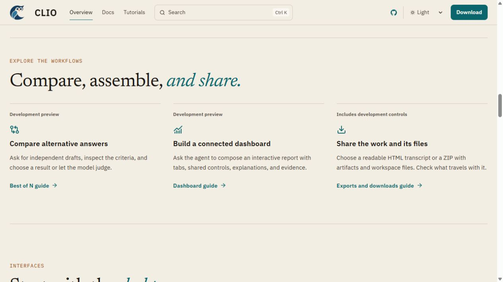
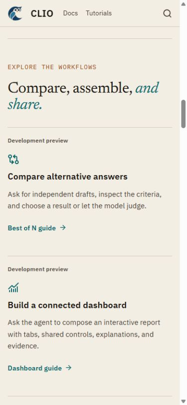

# Website feature coverage review, 2026-10-09

Website-only branch from current `main` (`f2ce2b8e`), targeting `main` for the
Pages workflow. No runtime feature, installer, release, or pinned widget engine
is changed by this update. The public site was read before editing.

## Reader-facing changes

- An overview section links to Best of N, dashboards, and exports/downloads.
- Three searchable guides are listed in the main docs navigation and linked from
  sessions, files, the docs introduction, and linked-data documentation.
- Best of N describes parallel independent drafts, separate reasoning, visible
  criteria, person/model selection, and sequential refinement. Example counts
  and scores come from the retained real Codex/Luna acceptance record.
- Dashboard guidance describes agent authoring, tabs, shared controls, visual
  references, revisions, PNG/HTML export, and supported rendered review. Its
  untouched light-mode capture explicitly labels its data synthetic.
- Export guidance compares one file, one visual, a dashboard, a transcript,
  session artifacts, and workspace files. It distinguishes existing
  Transcript/Effects/Full scopes from the development menu's named checkboxes.
  It explains Windows native download history versus macOS/Linux's Downloads
  folder, and preserves the user's choice to open a downloaded file.
- The old sessions note saying exports belong to a future release after beta-3
  is replaced with recording-coverage and precise development-control guidance.
- `site/FEATURE_COVERAGE.md` maps feature pages to their implementation/evidence
  and records the checks needed when changing availability after a release.

The feature PRs for the draft corrections, saved dashboards, native downloads,
visual review, and final artifact presentation are still open. The affected
guides and overview cards identify development behavior absent from beta 5.2.
Documentation publication must not be confused with release availability.

## Checks and actual browser review

- Website unit tests: **29 passed**.
- Video authoring tests used by the Pages workflow: **4 passed**.
- Astro check: **0 errors, 0 warnings**, with five existing hints.
- Production build: **76 pages built**, all internal links valid; Pagefind rebuilt.
- Complete browser suite: **14 passed**, including five new tests for the guide
  links, availability notes, desktop/mobile layouts in both themes, dashboard
  image dialog, and judge-mode documentation tabs.
- Direct in-app browser review: followed the overview guide links; inspected the
  three guides and full-size dashboard image; checked phone-width composition;
  searched for Best of N and found the new guide in the generated search index.
- The dashboard PNG matches its retained source by SHA-256. All 328 authored site
  files match the separate directory used for the successful build and tests.
- `git diff --check`: passed.

Local test commands used the frozen, already installed website dependencies.
The Windows Astro builder requires its root and linked dependencies on the same
drive; source copies were tested under
`D:/Temp/clio-site-feature-guides-20261009/site`. The build's `NODE_PATH` pointed to
the already installed `@bruits/satteri-win32-x64-msvc@0.10.5` native dependency.
The video tests used the installed Chrome via `DEMO_CHROME_PATH`. No production
configuration, dependency lock, security setting, or test assertion was weakened.

Exact commands from that site directory:

```powershell
node node_modules/vitest/vitest.mjs run
node node_modules/astro/bin/astro.mjs check
node node_modules/astro/bin/astro.mjs build
node node_modules/@playwright/test/cli.js test
# From site/video, with the installed Chrome configured:
node --test pointer-guide.test.mjs render-ffmpeg.test.mjs
```

The preview subprocess inherited `pnpm_config_verify_deps_before_run=false`
to reuse the matching installed dependencies without an automatic install.
Initial failed setup attempts involved cross-drive module paths, absent video
dependency lookup, native module lookup, and Chrome lookup. The final complete
checks above pass; failures were not converted to skips.

## Rendered evidence





Untouched browser captures, successful logs, and the source manifest are retained
under `D:/Libraries/Videos/clio_recordings/2026-10-09-website-feature-guides/`.
The automated element-only mobile screenshot includes a sticky header over the
element's top edge; it was rejected as a documentation image. The direct browser
phone-width screenshot above shows the actual anchored page with readable heading
and content. The original test image remains in the build's `test-results`.

The site is locally built and reviewed. Deployment requires the website PR to
land in `main` and the Pages workflow to complete; neither is claimed here.
