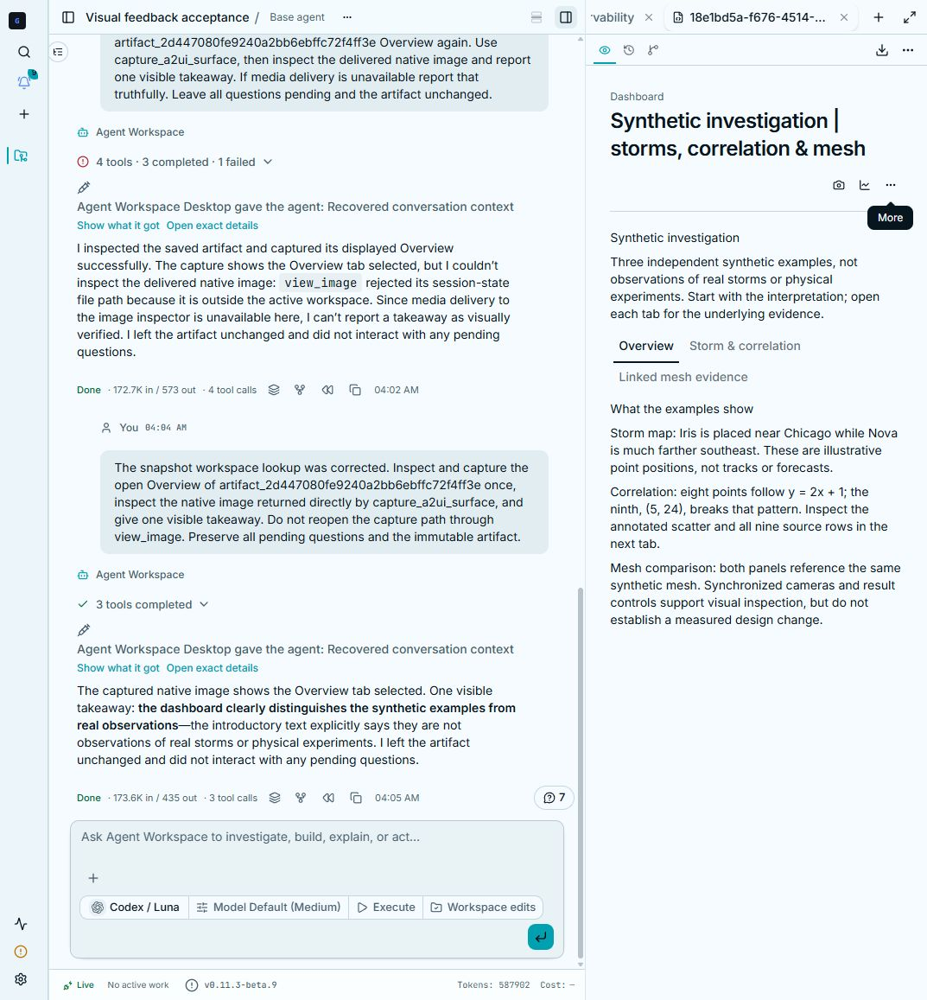
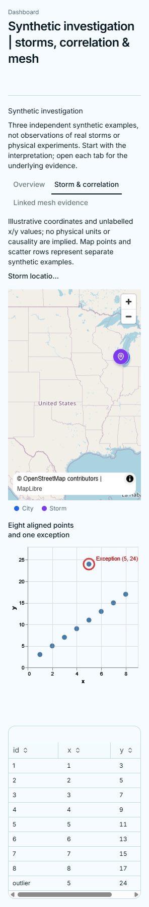
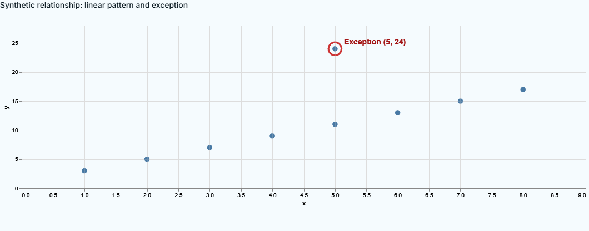

# Widget visual feedback acceptance, 2026-10-09

Status: **implemented runtime, partial live acceptance; retain draft status**.
The earlier skills/design-only update did not implement the whole feature.
Passing tests were not evidence of a working production visual loop.

## Implemented behavior

- A mounted, session-authorized viewer reports definition revision, local view
  epoch, visibility, data readiness and declared bindings. Control and capture
  requests belong to one viewer and reject stale or unavailable views.
- Live component/data updates remain producer updates. A pinned saved dashboard
  accepts changes to its displayed, declared data-model bindings without
  rewriting the immutable artifact. Tab, map camera, shared mesh camera,
  field/frame and threshold changes drive the actual renderer.
- Capture retains verified PNG pixels, image artifact identity and compact
  provenance, and delivers native image input to vision-capable models. Context
  folding resolves media in the session workspace, including when no tool call
  workspace context is active.
- Authored dashboard tabs remain beside chat and retain local state during
  unrelated streaming updates. Chart component replacement removes omitted
  preset properties, allowing layered annotations to replace the preset.
- Dashboard PNG and bundled HTML use the existing single-use prepared-download
  path. The PNG is the displayed tab; HTML contains the report and source data.
  Skills instruct agents to inspect, improve and recheck actual views, including
  readable defaults and optional detail. Question submission remains separate.

## Actual model and renderer evidence

These are synthetic fixtures, not observations of real storms, scientific
experiments, or evidence of a model accuracy/speed advantage. Native CLIO ReAct,
Codex models, registered source artifacts and the running CLIO browser renderer
were used. Operation-level checks and model reasoning are distinguished below.

| Scenario | Observed result | Limit |
| --- | --- | --- |
| Live map, Sol | Captured before/after native images; changed center, zoom to 7 and bearing to 25; identified the synthetic Iris point near Chicago. | Point positions, not real storm tracks; numerical baseline is 26.1383 km. |
| Live chart, Sol | Two native images; revised the actual layered scatter to circle and label (5,24); preserved all nine rows. | Eight points follow y=2x+1; the exception has residual +13. Visual pattern does not establish causality. |
| Live linked meshes, Sol | Two native images; changed shared camera from [4,3,5] to [6,2,4]; both views moved. The model correctly noted identical underlying mesh assets. | Camera behavior is verified; these panels do not establish a design evolution. |
| Authored dashboard, Sol | Wrote and published an editable multi-tab report; captured the saved Overview. Quiet overview, map/scatter/source rows and linked meshes remained separate tabs. | Initial authoring run alone did not prove every saved control. |
| Saved mesh controls, Luna | Controlled the actual saved view and received two native before/after images; handled two stale refusals by reinspecting. Returned to Overview. | Saved view changes do not rewrite the authored report. |
| All saved tabs, native operation check | Changed active tab, map camera, shared mesh camera/frame/threshold; captured matching reported states. Compared immutable report before/after and pending-question state. | This check exercised production tools and renderer; it was not model reasoning. |
| Ordinary main chat route, Luna | Loaded the review skill, inspected the pinned artifact and captured Overview. Three successful tools, native image delivery and a visible image-based takeaway. | One final successful turn after correcting two integration defects. |
| Dashboard export menu | Downloaded actual HTML and Overview/analysis PNG files from the UI. Inspected the PNGs: actual map tiles/markers, red chart annotation and all nine table rows are present. | Fresh offline file opening was blocked by browser file-URL policy; no independent offline acceptance claim. |

The first ordinary-session attempt exposed a viewer reset on every parent
render; memoizing the saved definition fixed it. Subsequent attempts exposed
snapshot hydration under the server installation workspace; resolving the
active session workspace fixed native image delivery. Real failures and their
corrections were retained, rather than being counted as successful reviews.

## Deterministic checks

- 267 focused backend tests passed on the pinned schema build, including the
  native-image hydration regression, ownership/revision/timeouts and dashboard
  integration. Subsequent PNG/session export regression pack: 39 passed.
- 125 renderer tests and 59 repository/catalog tests passed, including the
  official Basic catalog corpus. Production/offline renderer builds passed.
  Dashboard tests include preservation of human input,
  selected tab and viewer epoch through parent re-renders.
- The wider UI suite exposed a capture-wrapper regression in the existing
  rejected-update recovery test. Capture addresses now preserve the kernel's
  native node view and explicitly clear removed optional properties through
  its model API. The original recovery test passed unchanged alongside the
  input/preset checks. A fresh Luna chart run (`chart-gpt-6-luna-55bfcc23`)
  received two new native chart images at revisions 10 and 11, noticed the
  clipped top point, widened the scale, and rendered a real red circle and
  label. Its retained context also contains three older Overview captures;
  those are not counted as new chart observations.
- Final saved-view operation checks repeated eight local controls and five
  native captures across all three tabs, including map bearing/zoom and shared
  mesh camera/frame/threshold. The immutable report stayed byte-for-byte
  unchanged. A rushed first batch exhausted three stale replies during mesh
  mounting; that failure is retained separately. Inspecting the settled ready
  epoch before capturing completed the repeat, with one correctly refused
  transient change. Another real menu PNG download retained the map, chart
  annotation and all nine table rows on the final renderer.
- The site build and all nine existing browser tests passed. Inactive showcase
  panels are now inert and hidden from accessibility during tab transitions,
  correcting a duplicate-action failure without weakening the tests.
- The wider browser suite initially failed 20 checks because its older fixture
  omitted the new visual-feedback endpoint, and exposed a one-pixel Data/Work
  allocation defect. The fixture now speaks the current report/reply contract;
  production layout uses fractional available height and prevents section flex
  shrink. All four existing section-allocation browser checks and six layout
  unit tests passed with their original height tolerances. Two Windows visual
  baselines were inspected against actual and difference images before being
  refreshed: they predated inherited duration/question indicators, composer
  styling and the standalone workspace brand. Screenshot thresholds were not
  increased; Linux baselines were unchanged. These fixture checks are not live
  model acceptance.
- The entire configured Windows browser suite then passed: **84 passed,
  no failed or skipped checks** (`visual-full-browser-final.log`, six minutes).
  The final UI commit is `b2fc6e2a182dfee3771e1ecf940145591e014df6`.
- Backend CI on `e59113d99b353e03c5b815f213ffd14914d217c8` passed all six
  Python shards and both coverage jobs, alongside schema, document-runtime,
  Docker and Pages workflows. This is the existing CI selection, with its
  platform/integration skip conditions, not proof that every repository test
  executed without skips. The final UI pin and this evidence update trigger
  another backend run; that head is not represented by the earlier green run.
- Ruff, focused mypy, frontend lint/ownership/size guards, TypeScript and the
  production/offline renderer builds were checked. The broad table-query
  pyright invocation also reports existing PyArrow compute typing errors; it
  is not claimed as a clean repository-wide type check.
- Canonical map/tab schema changes are pinned to clio-schemas commit
  `90f55a3b990e9fb7c29aa7aa73b9a410a33d2e2d` (draft schemas PR #28,
  version 0.6.0b5). Both schema CI jobs passed. No package was published.

These focused checks do not represent an entire repository test suite or
cross-platform desktop acceptance. Live browser/model acceptance was performed
on Windows. Linux and macOS desktop visual-loop acceptance was not performed.

## Unresolved release blockers and unverified scope

1. A longer saved-dashboard Sol review crashed the isolated native context-store
   daemon with `0xC0000005` during `put`; its RPC stalled and the run did not
   complete. The underlying crash has not been fixed. Shorter successful runs
   after restarting the private test profile do not resolve that failure.
2. Independently reopening the downloaded HTML offline remains unverified due
   to the browser's file-URL restriction. Offline packaging, data retention and
   local component tests passed, but are not substitutes for that live check.
3. Linux/macOS desktop acceptance and larger data/longer investigation coverage
   remain outstanding. Generic annotation overlays, arbitrary undeclared widget
   controls and hidden/headless captures are not implemented. VIGIL is deferred.

One earlier Luna run also ended with a provider connection closure. Another
chart run claimed an annotation that had not rendered: the component binding
defect was corrected and the subsequent Sol image pair verified the real mark.
Model answers themselves are not treated as proof of rendering or correctness.

## Retained local evidence

Full traces, compact summaries, native PNGs, failure logs and downloaded exports
are under `D:/Libraries/Videos/clio_recordings/2026-10-09-widget-visual-feedback/`.
Key files include `main-session-final.json`, `main-session-native-capture.png`,
`saved-view-native-operations.json`, `saved-agent-crash.log`, `dashboard-export.html`
and `dashboard-export-analysis.png`. Final renderer evidence includes
`chart-gpt-6-luna-55bfcc23.json`, `final-kernel-luna-capture-4.png` (before),
`final-kernel-luna-capture-5.png` (after), `final-kernel-saved-native-operations.json`,
`final-kernel-saved-native-operations-failure1.json` and
`final-kernel-dashboard-export.png`. Test/build logs are under
`D:/Temp/clio-document-tests/visual-*`.

The installed beta and primary checkout were not changed. These changes remain
in draft branches; nothing was merged or released.
