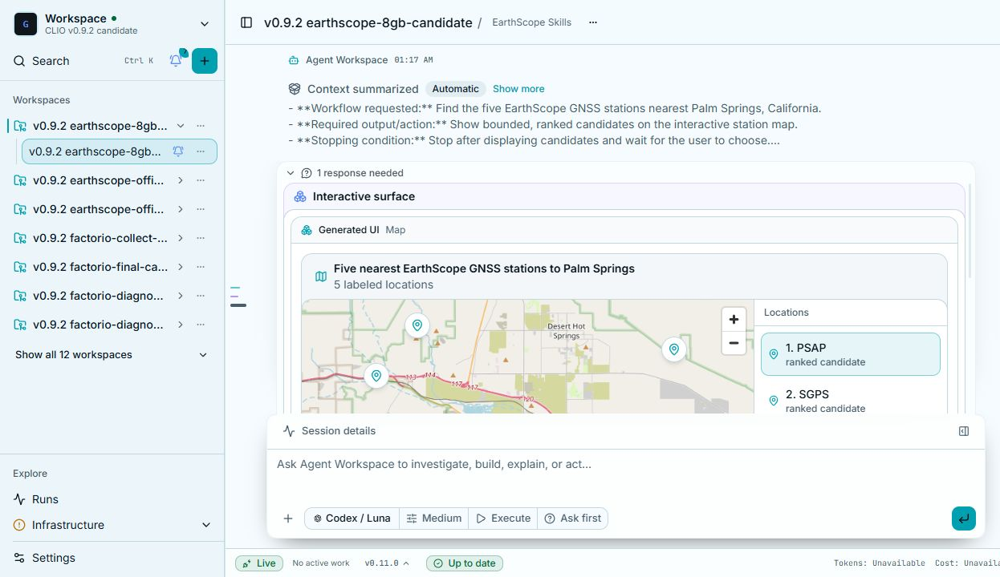
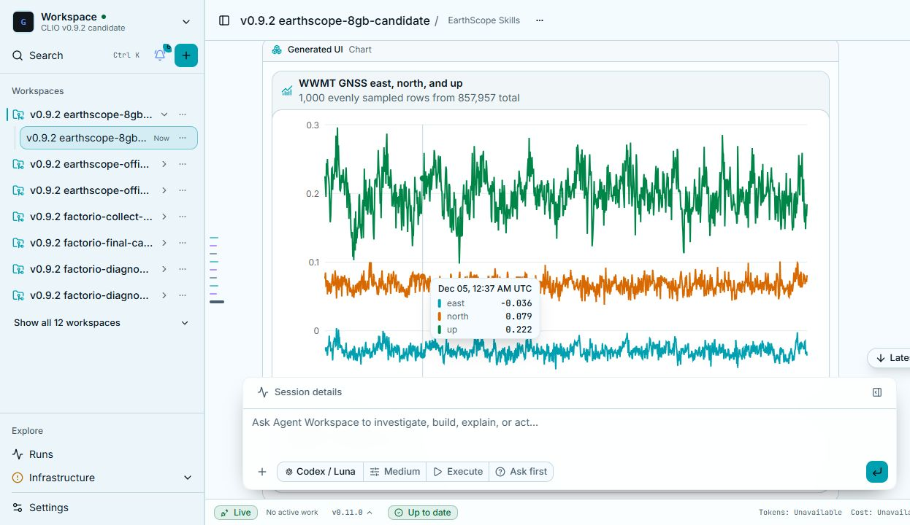
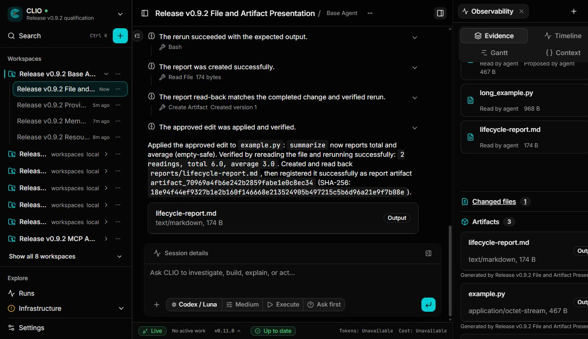
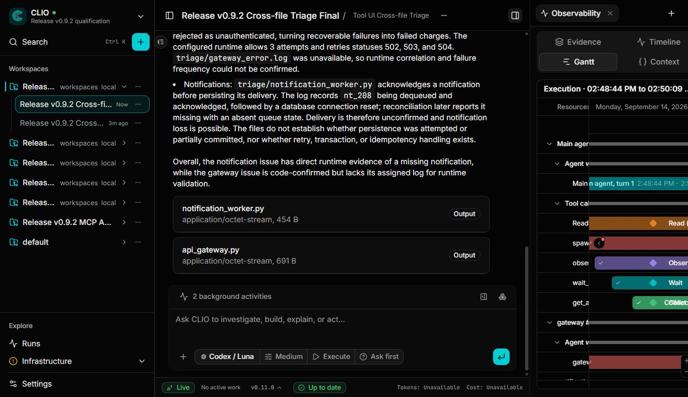

import { Aside, Steps } from '@astrojs/starlight/components';

In this tutorial you ask a question about real data and follow CLIO from the question to a chart. You will find the five EarthScope GNSS stations nearest Palm Springs, California, choose one from a map, plot its position over time, and look at the evidence CLIO kept. GNSS stations measure their own position continuously, so their time series show how the ground moves.

You need a computer where you can install the desktop app and a model you can connect. The analysis pulls public data, so it needs an internet connection.

<Steps>

1. Install the desktop app.

   Follow [Install](/docs/install/) and open CLIO.

2. Connect a model.

   Follow [Connect a model](/docs/connect-a-model/). A larger model gives the most reliable results for a multi-step analysis like this one.

3. Start a session with the EarthScope blueprint.

   Choose the plus button at the top of the sidebar, then **New session**. Name the session, choose a workspace, and open the **Agent blueprint** list. Choose **EarthScope Skills**. Then choose **Create session**.

   If EarthScope Skills is not in the list, install it first from the default marketplace: open Settings, choose **Marketplaces & blueprints**, open the **Marketplaces** tab, and choose **Install** next to it. See [Agent blueprints](/docs/blueprints/).

   Under the message box, leave **Execute** as the execution mode and **Ask first** as the confirmation policy. You may be asked to approve some actions as the run goes. Answering **Allow for session** keeps the rest of the tutorial uninterrupted. See [Permissions and sandbox](/docs/permissions/).

4. Ask the question.

   The welcome screen offers starter prompts, including an EarthScope one about Los Angeles. For this tutorial, type this prompt instead:

   ```text
   Find the five EarthScope GNSS stations nearest Palm Springs, California, show them on a map, and wait for me to choose one.
   ```

   The agent works out where Palm Springs is, searches for EarthScope station data, ranks the nearest stations, and stops. Watch the transcript while it works. Each tool call appears with its arguments and result.

   When it is ready, a banner above the message box says that a response is needed, and an interactive map appears with the stations labeled and ranked.

   

   Your station names and order depend on the data CLIO finds, and the layout may differ from the capture.

5. Choose a station.

   Select a station in the list on the map and confirm your choice. The picker may let you select more than one station. Choose one for this tutorial. The agent continues with the station you picked.

6. Ask for the time series.

   Type a follow-up in the same session:

   ```text
   Plot the east, north, and up time series for that station.
   ```

   The agent stages the station's data and draws a chart in the session. Look for a title that names the station, three lines for east, north, and up, and a line under the title that tells you how much of the data the chart shows. Long records are downsampled for display, and the chart says so, for example "1,000 evenly sampled rows from 857,957 total". Hover the lines to read values at a point in time.

   

   The chart above comes from a separate run with a different station, so the numbers in your chart will differ.

7. Inspect the evidence.

   Open the observability panel with the panel button at the top right of the session, and choose the **Evidence** tab. Look for the files the agent read, any files it changed, and the artifacts it created, such as the staged data and the plot. Artifacts are stored with a content hash.

   

   Open the **Timeline** tab to see each step in order, and the **Gantt** tab to see how the work was spread over time.

   

</Steps>

## What to expect

Model output varies. The agent may word its answers differently, take a different number of steps, or ask you something this tutorial does not mention. What should stay the same is the shape of the work: a question that stops for your choice, a chart built from data CLIO fetched, and a record of each step. If the agent says it could not find data, read its explanation, then ask it to try again or to use a different station from the list.

If a tool fails to start, see [Troubleshooting](/docs/troubleshooting/).

## Next steps

- Ask for a second station and compare the two charts.
- Read how evidence, artifacts, and lineage work in [Memory and evidence](/docs/memory-and-evidence/).
- Write your own agent in [Agent blueprints](/docs/blueprints/).

:::note[Captures to refresh]
The images above were recorded from different sessions and an earlier version of CLIO (v0.9.2). Recording these would make the tutorial match one run end to end:

- The New session dialog with the **Agent blueprint** list open and EarthScope Skills selected.
- The map after you select a station, with the confirm button visible.
- The time series chart for the station chosen in the map capture.
- The Evidence tab for this exact run, with the artifacts expanded to show content hashes.
- The artifact view with the **Versions** and **Lineage** tabs.
:::
